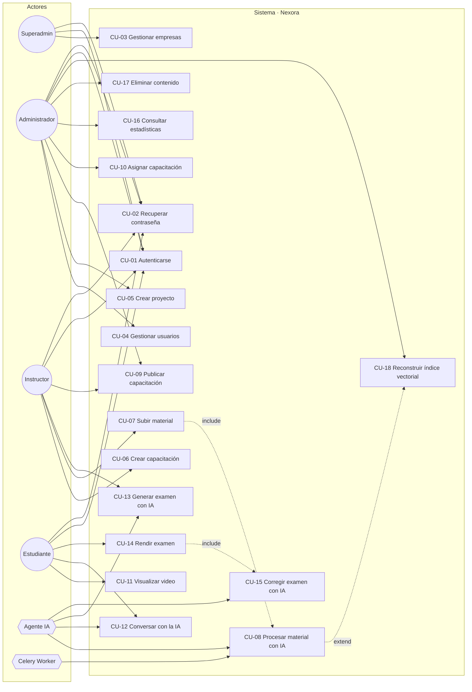

# 04 · Casos de Uso

## Diagrama de Casos de Uso

---

## CU-01 · Autenticarse

| Campo | Detalle |
|-------|---------|
| **Actor principal** | Cualquier usuario |
| **Precondición** | El usuario existe y está activo |
| **Postcondición** | Sesión JWT emitida y auditada |
| **Disparador** | El usuario envía el formulario de login |

**Flujo principal**
1. El usuario ingresa email y contraseña.
2. El sistema valida el formato de los datos.
3. El sistema verifica las credenciales contra el hash Argon2.
4. El sistema verifica que el usuario esté activo y su empresa también.
5. El sistema emite `access` (30 min) y `refresh` (7 días).
6. El sistema registra el evento `LOGIN_SUCCESS` en auditoría.
7. El sistema devuelve tokens + perfil + permisos.

**Flujos alternativos**
- 3a. Credenciales inválidas → 401 genérico, registro `LOGIN_FAILED`, incremento del contador de rate limit.
- 4a. Usuario inactivo → 403 `USER_DISABLED`.
- 4b. Empresa suspendida → 403 `TENANT_SUSPENDED`.
- 3b. Más de 5 intentos fallidos en 1 min desde la misma IP → 429.

---

## CU-05 · Crear proyecto

| Campo | Detalle |
|-------|---------|
| **Actor** | Administrador |
| **Precondición** | Autenticado con rol ADMIN |
| **Postcondición** | Proyecto creado + colección vectorial aprovisionada |

**Flujo principal**
1. El admin abre "Nuevo proyecto".
2. Ingresa nombre, código, descripción, color/ícono.
3. El sistema valida unicidad de `slug` dentro de la empresa.
4. El sistema persiste el proyecto asociado a la empresa del token.
5. El sistema crea el registro `VectorCollection` y el directorio del índice FAISS `indices/{tenant}/{project_id}/`.
6. Devuelve 201 con el proyecto.

**Alternativos**
- 3a. Slug duplicado → 409 `PROJECT_SLUG_TAKEN`.
- 5a. Fallo al crear el índice → se crea igualmente el proyecto con `vector_status = PENDING` y se encola reintento.

---

## CU-07 · Subir material

| Campo | Detalle |
|-------|---------|
| **Actor** | Instructor / Administrador |
| **Precondición** | Existe una lección destino |
| **Postcondición** | Material en `PENDING` y tarea de ingesta encolada |

**Flujo principal**
1. El instructor selecciona archivo(s) en la lección.
2. El frontend solicita `POST /materials/upload-session` con nombre, tamaño y MIME.
3. El backend valida extensión, tamaño máximo y cuota, y devuelve `upload_id`.
4. El frontend envía el archivo por trozos de 5 MB a `POST /materials/{upload_id}/chunk`.
5. El backend ensambla, calcula SHA-256, valida el MIME real con `python-magic`.
6. El backend crea el `Material` en `PENDING` y encola `ingest_material.delay(material_id)`.
7. Devuelve 201 y el frontend se suscribe al canal WebSocket `material.{id}`.

**Alternativos**
- 5a. MIME real no coincide con la extensión → 400 `INVALID_FILE_TYPE`, archivo eliminado.
- 5b. Hash ya existente en el proyecto → 409 `DUPLICATE_MATERIAL` con enlace al existente.
- 4a. Se interrumpe la carga → los trozos se conservan 24 h y la carga es reanudable.

---

## CU-08 · Procesar material con IA

| Campo | Detalle |
|-------|---------|
| **Actor** | Celery Worker + Agente IA |
| **Precondición** | Material en `PENDING` |
| **Postcondición** | Material `AVAILABLE` con transcripción, capítulos, resumen, conceptos, FAQ y embeddings indexados |

**Flujo principal**
1. La tarea toma el material y lo pasa a `PROCESSING`; notifica por WebSocket.
2. **Si es video:** `ffmpeg` extrae audio WAV 16 kHz mono. Se obtiene duración y se genera miniatura.
3. Whisper transcribe produciendo segmentos `{start, end, text}` y detecta el idioma.
4. **Si es documento:** el extractor correspondiente (PyMuPDF / python-docx / python-pptx / texto plano) devuelve bloques con número de página o diapositiva.
5. Estado → `ANALYZING`.
6. El *chunker* genera fragmentos de ~800 tokens con 15 % de solapamiento, preservando `start_time`/`end_time` o `page`.
7. El proveedor de embeddings vectoriza los chunks en lotes; se persisten en PostgreSQL y se agregan al índice FAISS del proyecto.
8. El LLM genera, en cadenas independientes y reintentables: capítulos, resumen ejecutivo, resumen por capítulo, conceptos clave, FAQ y banco de preguntas candidatas.
9. Estado → `AVAILABLE`; se notifica por WebSocket y se registra el consumo de IA.

**Alternativos**
- 2a. `ffmpeg` falla → `ERROR` con `error_code = AUDIO_EXTRACTION_FAILED`, reintento con backoff (máx. 3).
- 3a. Audio sin voz detectable → `ERROR` `NO_SPEECH_DETECTED`.
- 7a. El proveedor de embeddings no responde → reintento; a la tercera, `ERROR` `EMBEDDING_PROVIDER_UNAVAILABLE` y el material queda reprocesable.
- 8a. El LLM devuelve JSON inválido → se reintenta con *output parser* correctivo; si falla, se guarda lo obtenido y se marca `partial_analysis = true` (el material igual queda `AVAILABLE` porque el RAG ya funciona con los chunks).

---

## CU-11 · Visualizar video

**Flujo principal**
1. El estudiante abre una lección de tipo video.
2. El backend valida la inscripción y emite una URL firmada con expiración de 4 h.
3. El reproductor carga el video, los capítulos y la transcripción.
4. Cada 10 s el frontend envía `PATCH /progress` con `position_seconds`.
5. Al alcanzar el 90 %, se marca `COMPLETED` y se recalcula el avance de la capacitación.

**Alternativos**
- 2a. Usuario no inscrito → 403 `NOT_ENROLLED`.
- 2b. Material no `AVAILABLE` → 409 `MATERIAL_NOT_READY`.

---

## CU-12 · Conversar con la IA

| Campo | Detalle |
|-------|---------|
| **Actor** | Estudiante |
| **Precondición** | Inscrito en la capacitación, con al menos un material `AVAILABLE` |
| **Postcondición** | Respuesta con citas verificables y mensajes persistidos |

**Flujo principal**
1. El estudiante escribe una pregunta en el chat de la capacitación.
2. El sistema recupera el historial reciente y reescribe la pregunta como consulta autónoma (*query rewriting*).
3. El *retriever* híbrido busca en FAISS (filtrado por `training_id`) y por texto completo; fusiona con RRF.
4. Se aplica reordenamiento y se seleccionan los `top-k` fragmentos por encima del umbral de similitud.
5. Si no hay fragmentos suficientes → responde "no encuentro esa información en este material" y ofrece contactar al instructor. **Fin.**
6. Se construye el prompt con el contexto citado y las instrucciones anti-alucinación.
7. El LLM genera la respuesta en streaming por WebSocket.
8. Se validan las citas: toda referencia debe corresponder a un chunk realmente entregado.
9. Se persisten pregunta, respuesta, citas y consumo de tokens.

**Alternativos**
- 7a. El proveedor LLM cae → 503 `AI_PROVIDER_UNAVAILABLE`, el mensaje del usuario se conserva.
- 8a. Cita inválida detectada → se elimina la cita y se marca la respuesta para revisión.

---

## CU-13 · Generar examen con IA

**Flujo principal**
1. El instructor define: capacitación, nº de preguntas, distribución de tipos, nivel, puntaje total.
2. El sistema selecciona los chunks más representativos (cobertura por capítulo, no solo similitud).
3. El LLM genera preguntas con salida estructurada validada por esquema (Pydantic).
4. Se valida: unicidad semántica entre preguntas, exactamente una opción correcta en selección simple, presencia de explicación y referencia a fuente.
5. Se crea el examen en `DRAFT` con sus preguntas.
6. El instructor revisa, edita y publica.

**Alternativos**
- 2a. Material insuficiente (< 10 chunks) → 409 `INSUFFICIENT_CONTENT`.
- 4a. Pregunta inválida o duplicada → se descarta y se regenera hasta 2 veces; si no se alcanza el número pedido, se entrega lo obtenido con aviso.

---

## CU-15 · Corregir examen con IA

**Flujo principal**
1. Al recibir `SUBMITTED`, el intento pasa a `GRADING`.
2. Preguntas cerradas: comparación determinística con la clave.
3. Preguntas de respuesta corta: comparación normalizada + verificación semántica con LLM.
4. Preguntas abiertas: el LLM evalúa con rúbrica (0–100 %) y produce justificación.
5. Se calcula el puntaje total y si aprueba (`>= passing_score`).
6. Por cada respuesta incorrecta, se recupera el fragmento fuente y se genera retroalimentación con enlace a la sección a repasar.
7. El intento pasa a `GRADED` y se notifica al estudiante.

**Alternativos**
- 4a. El LLM no responde → las abiertas quedan `PENDING_MANUAL_REVIEW` y el puntaje se marca provisional.

---

## CU-17 · Eliminar contenido

**Flujo principal**
1. El admin elimina un material / lección / capacitación.
2. El sistema pide confirmación explícita indicando el impacto (nº de chunks, inscripciones, intentos).
3. Se aplica borrado lógico (`deleted_at`) y se encola la limpieza física.
4. Se eliminan los chunks del material y se marca el índice del proyecto para reconstrucción.
5. Se registra en auditoría.

**Alternativos**
- 2a. Existen intentos de examen asociados → solo se permite archivar, no eliminar.

---

## CU-18 · Reconstruir índice vectorial

**Flujo principal**
1. El admin solicita reconstruir el índice de un proyecto.
2. Se encola `rebuild_project_index.delay(project_id)`.
3. La tarea lee todos los chunks del proyecto desde PostgreSQL (fuente de verdad).
4. Regenera embeddings por lotes con el proveedor configurado.
5. Construye un índice nuevo en un directorio temporal.
6. Intercambio atómico del índice y recarga en caliente.
7. Notifica finalización.

**Alternativos**
- 4a. Cambio de modelo de embeddings con distinta dimensión → se registra la nueva dimensión en `VectorCollection` y se fuerza reconstrucción completa (no incremental).
