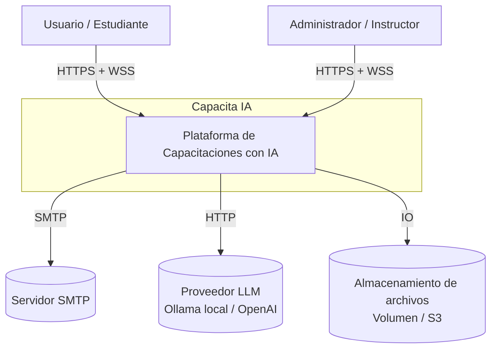
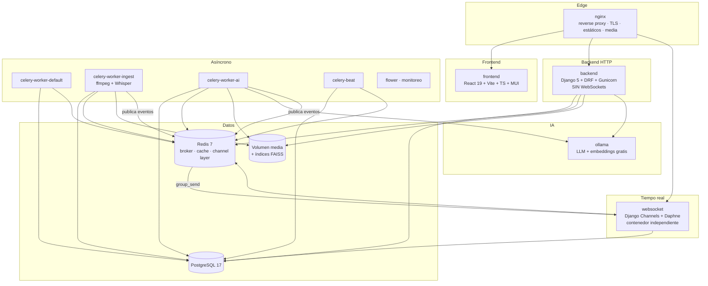
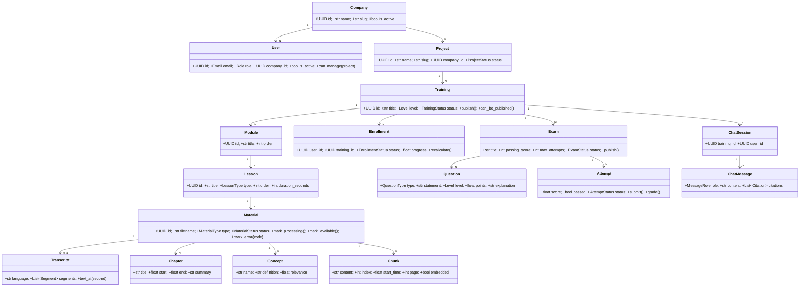
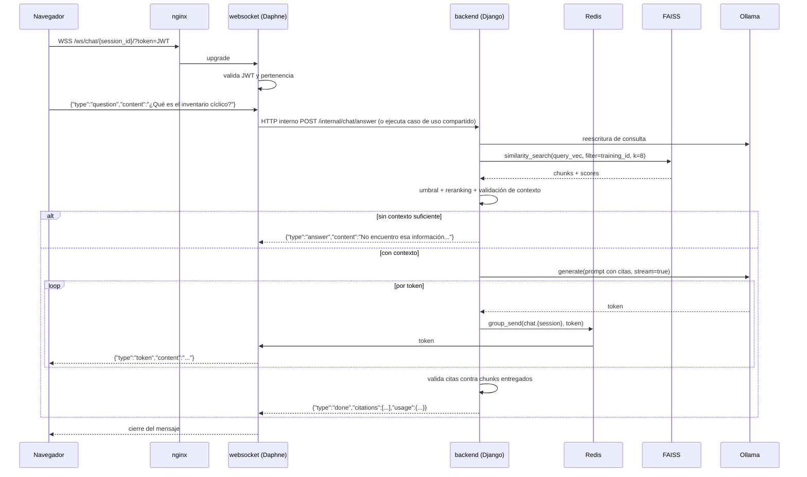
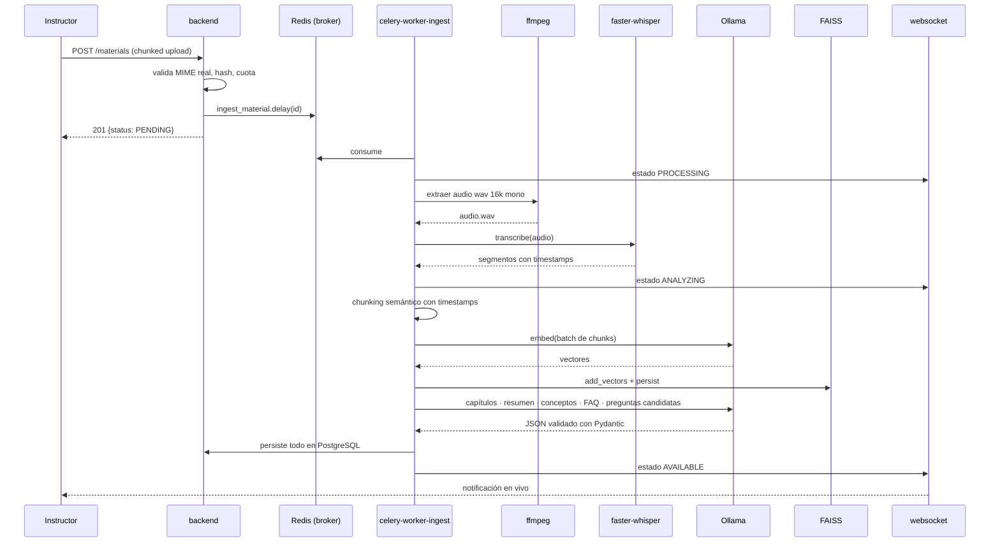
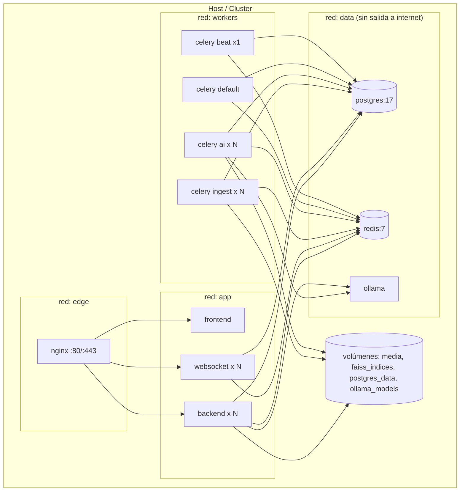

# 05 · Arquitectura

## 1. Vista de contexto (C4 nivel 1)



## 2. Vista de contenedores (C4 nivel 2 · = servicios Docker)



**Decisión clave (restricción del cliente):** el contenedor `backend` corre **solo HTTP/WSGI** con Gunicorn.
Todo WebSocket vive en el contenedor `websocket` (Channels + Daphne). La comunicación entre ambos es
indirecta: el backend y los workers publican en el *channel layer* de Redis y Daphne entrega a los clientes.

## 3. Clean Architecture (dentro del backend)

```
┌──────────────────────────────────────────────────────────────┐
│ PRESENTATION      views · serializers · urls · permissions   │
│                   consumers (en el servicio websocket)       │
│                   ↓ depende de ↓                             │
├──────────────────────────────────────────────────────────────┤
│ APPLICATION       use cases · DTOs · puertos (interfaces)    │
│                   servicios de aplicación · unit of work     │
│                   ↓ depende de ↓                             │
├──────────────────────────────────────────────────────────────┤
│ DOMAIN            entidades · value objects · reglas         │
│                   excepciones de dominio · eventos           │
│                   *** SIN Django, sin DRF, sin ORM ***       │
└──────────────────────────────────────────────────────────────┘
             ↑ implementa los puertos ↑
┌──────────────────────────────────────────────────────────────┐
│ INFRASTRUCTURE    modelos ORM · repositorios · adaptadores   │
│                   LLM · embeddings · FAISS · storage · email │
│                   Celery tasks · publisher de eventos        │
└──────────────────────────────────────────────────────────────┘
```

**Regla de dependencias:** las flechas apuntan siempre hacia adentro.
`domain` no importa nada de `application`, `infrastructure` ni `presentation`.
`application` define **puertos** (clases abstractas) que `infrastructure` implementa.
La inyección se resuelve en un **contenedor de dependencias** simple (`src/shared/container.py`)
configurado por variables de entorno.

### Ejemplo del flujo de una petición

```
HTTP POST /api/v1/trainings/{id}/chat
   │
   ▼ presentation/views.py            ← DRF: autenticación, permisos, validación
   │   ChatSerializer(data).is_valid()
   ▼ application/use_cases/answer_question.py
   │   AnswerQuestionUseCase(retriever_port, llm_port, chat_repo).execute(dto)
   ▼ domain/services/citation_policy.py      ← regla pura: validar citas
   ▼ infrastructure/ai/faiss_retriever.py    ← implementa RetrieverPort
   ▼ infrastructure/ai/ollama_provider.py    ← implementa LLMPort
   ▼ infrastructure/persistence/repositories/chat_repository.py
```

## 4. Diagrama de componentes del backend

```mermaid
graph TD
    subgraph presentation
        V1[accounts.views] --> UC1
        V2[projects.views] --> UC2
        V3[trainings.views] --> UC3
        V4[ai.views] --> UC4
        V5[assessments.views] --> UC5
    end
    subgraph application
        UC1[Casos de uso Accounts]
        UC2[Casos de uso Projects]
        UC3[Casos de uso Trainings]
        UC4[Casos de uso AI]
        UC5[Casos de uso Assessments]
        P1[[LLMPort]]
        P2[[EmbeddingsPort]]
        P3[[VectorStorePort]]
        P4[[TranscriberPort]]
        P5[[DocumentExtractorPort]]
        P6[[StoragePort]]
        P7[[EventPublisherPort]]
        P8[[Repositorios]]
    end
    subgraph domain
        D1[Entidades y VOs]
        D2[Servicios de dominio]
        D3[Excepciones]
    end
    subgraph infrastructure
        I1[OllamaProvider / OpenAIProvider] -.implementa.-> P1
        I2[OllamaEmbeddings / OpenAIEmbeddings / HFLocal] -.-> P2
        I3[FaissVectorStore] -.-> P3
        I4[FasterWhisperTranscriber] -.-> P4
        I5[PyMuPDF / Docx / Pptx / Txt] -.-> P5
        I6[LocalStorage / S3Storage] -.-> P6
        I7[RedisChannelPublisher] -.-> P7
        I8[Repositorios Django ORM] -.-> P8
    end
    UC1 & UC2 & UC3 & UC4 & UC5 --> D1 & D2
    UC4 --> P1 & P2 & P3
```



## 5. Estrategia multi-tenant

- **Modelo:** *shared database, shared schema* con columna `company_id` (discriminador).
- **Aislamiento:** un middleware resuelve el tenant desde el JWT y lo deja en un `ContextVar`.
  Todos los managers de modelos con tenant heredan de `TenantManager`, que filtra automáticamente.
- **Aislamiento vectorial:** un índice FAISS por proyecto en `indices/{company_slug}/{project_id}/`.
  Físicamente separado → imposible el cruce entre empresas.
- **Archivos:** `media/{company_slug}/{project_id}/{material_id}/...`

## 6. Decisiones de arquitectura (ADR resumidos)

| ADR | Decisión | Alternativas | Razón |
|-----|----------|--------------|-------|
| ADR-01 | Clean Architecture con módulos por dominio | Django "app-por-tabla" | Reglas de negocio testeables sin BD; permite extraer módulos a microservicios |
| ADR-02 | FAISS con índice por proyecto | pgvector, Qdrant, Chroma | Requerido por el cliente; sin servicio extra; aislamiento natural. Se abstrae tras `VectorStorePort` para migrar |
| ADR-03 | WebSocket en contenedor aparte (Daphne) | ASGI unificado | Restricción explícita del cliente; escala y falla de forma independiente |
| ADR-04 | Ollama como proveedor por defecto | OpenAI | **Costo cero**, datos que no salen de la empresa; el puerto permite cambiar a OpenAI con una variable |
| ADR-05 | `faster-whisper` en vez de `openai-whisper` | Whisper original, API de OpenAI | 4× más rápido en CPU, menor RAM, gratuito y local |
| ADR-06 | Colas Celery separadas (`ingest`, `ai`, `default`) | Cola única | La transcripción es CPU-intensiva; no debe bloquear tareas cortas |
| ADR-07 | Chunks como fuente de verdad en PostgreSQL | Solo en FAISS | Permite regenerar embeddings y cambiar de modelo/proveedor sin perder datos |
| ADR-08 | RAG híbrido (vectorial + full-text) con RRF | Solo vectorial | Mejora *recall* en nombres propios, códigos y siglas del ERP |
| ADR-09 | JWT stateless + blacklist de refresh en Redis | Sesiones | Escalado horizontal sin estado compartido |
| ADR-10 | Salidas del LLM validadas con Pydantic | Parseo de texto libre | Robustez ante modelos pequeños locales |

## 6.1 Diagrama de clases (núcleo del dominio)



## 7. Diagrama de secuencia · Chat RAG



## 8. Diagrama de secuencia · Ingesta de video



## 9. Diagrama de despliegue



## 10. Evolución a microservicios

El monolito modular está preparado para extraer servicios sin reescribir el dominio:

| Fase | Extracción | Disparador |
|------|-----------|------------|
| 1 | `ai-service` (ingesta + RAG + agente) | La ingesta compite por recursos con la API |
| 2 | `assessment-service` | Reglas de evaluación con ciclo de vida propio |
| 3 | `identity-service` (Keycloak u OIDC propio) | Necesidad de SSO corporativo |

Cada módulo ya tiene su propio `domain`, `application`, `infrastructure` y `presentation`, y se comunica
con los demás mediante casos de uso y eventos — nunca importando modelos ORM ajenos.
