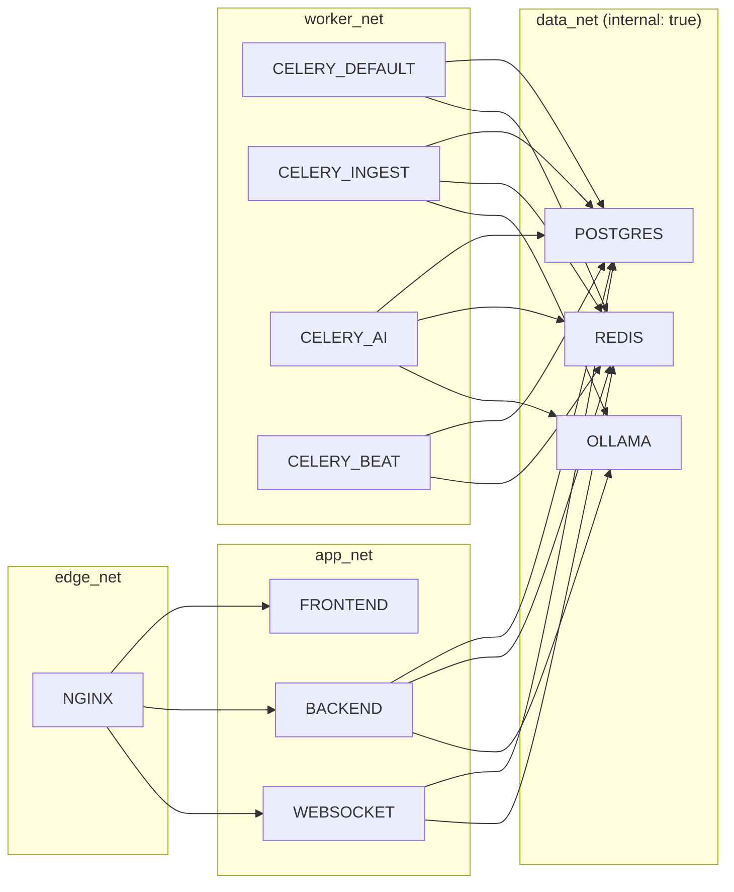

# 08 · Arquitectura de Contenedores e Infraestructura

## 1. Inventario de servicios

| Servicio | Imagen base | Puerto interno | Rol | Escala |
|----------|-------------|----------------|-----|--------|
| `nginx` | `nginx:1.27-alpine` | 80 / 443 | Reverse proxy, TLS, estáticos, media protegida, upload grande | 1–2 |
| `frontend` | `node:22-alpine` → `nginx` (prod) | 5173 (dev) / 80 (prod) | SPA React | N |
| `backend` | `python:3.13-slim` | 8000 | API REST (Gunicorn/WSGI). **Sin WebSockets** | N |
| `websocket` | `python:3.13-slim` | 8001 | Channels + Daphne (ASGI). **Contenedor independiente** | N |
| `postgres` | `postgres:17-alpine` | 5432 | Base de datos | 1 (+réplicas) |
| `redis` | `redis:7-alpine` | 6379 | Broker Celery, cache, channel layer | 1 |
| `celery-worker` | = backend | — | Cola `default` | N |
| `celery-ingest` | = backend + ffmpeg | — | Cola `ingest` (transcripción, extracción) | N |
| `celery-ai` | = backend | — | Cola `ai` (embeddings, LLM) | N |
| `celery-beat` | = backend | — | Tareas programadas | **1** |
| `flower` | `mher/flower` | 5555 | Monitoreo de Celery (solo dev/interno) | 1 |
| `ollama` | `ollama/ollama` | 11434 | LLM + embeddings **gratuitos** locales | 1 |
| `mailhog` | `mailhog/mailhog` | 8025 | Captura de correo en desarrollo | 1 (solo dev) |

## 2. Topología de red



`data_net` se declara `internal: true` en producción: PostgreSQL, Redis y Ollama no tienen salida ni
entrada desde Internet.

## 3. Volúmenes

| Volumen | Montado en | Contenido | Backup |
|---------|-----------|-----------|--------|
| `postgres_data` | `/var/lib/postgresql/data` | Base de datos | Diario (pg_dump + WAL) |
| `media_data` | `/app/media` | Videos, documentos, miniaturas | Diario incremental |
| `faiss_indices` | `/app/indices` | Índices FAISS por proyecto | Diario (reconstruible) |
| `static_data` | `/app/staticfiles` | Estáticos de Django | No (se regenera) |
| `redis_data` | `/data` | Persistencia AOF | Opcional |
| `ollama_models` | `/root/.ollama` | Modelos descargados | No (se re-descargan) |

## 4. Estrategia de imágenes

- **Multi-stage** en todos los Dockerfile: etapa `builder` (compila wheels / bundle) y etapa `runtime` mínima.
- Usuario **no root** (`appuser`) en runtime.
- `.dockerignore` estricto (sin `.git`, `node_modules`, `venv`, `media`).
- Capa de dependencias separada de la capa de código → caché efectiva.
- `HEALTHCHECK` en cada imagen.
- Solo `celery-ingest` incluye `ffmpeg` y los modelos de Whisper; el resto queda liviano.

## 5. Perfiles de entorno

| Aspecto | Desarrollo (`docker-compose.yml`) | Producción (`docker-compose.prod.yml`) |
|---------|-----------------------------------|-----------------------------------------|
| Frontend | Vite dev server con HMR, código montado | Build estático servido por nginx |
| Backend | `runserver` con autoreload, `DEBUG=1` | Gunicorn, 4 workers gthread, `DEBUG=0` |
| WebSocket | Daphne con reload | Daphne multi-proceso tras nginx |
| Código | Bind mounts | Copiado a la imagen |
| TLS | No | Certificados montados + redirección 80→443 |
| Correo | MailHog | SMTP real |
| Logs | Consola legible | JSON a stdout (recolectados por el orquestador) |
| Límites | Sin límites | `deploy.resources.limits` por servicio |
| Réplicas | 1 | backend 3, websocket 2, workers 2–4 |
| Migraciones | Manual | Job de inicialización antes del arranque |

## 6. Variables de entorno (contrato)

```dotenv
# ── Django ──────────────────────────────────────────────
DJANGO_SETTINGS_MODULE=config.settings.dev
SECRET_KEY=cambiar-en-produccion
DEBUG=1
ALLOWED_HOSTS=localhost,127.0.0.1,backend,nginx
CORS_ALLOWED_ORIGINS=http://localhost:5173,http://localhost

# ── Base de datos ───────────────────────────────────────
POSTGRES_DB=capacita
POSTGRES_USER=capacita
POSTGRES_PASSWORD=capacita
POSTGRES_HOST=postgres
POSTGRES_PORT=5432

# ── Redis / Celery ──────────────────────────────────────
REDIS_URL=redis://redis:6379
CELERY_BROKER_URL=redis://redis:6379/0
CELERY_RESULT_BACKEND=redis://redis:6379/1
CHANNEL_LAYERS_URL=redis://redis:6379/2
CACHE_URL=redis://redis:6379/3

# ── JWT ─────────────────────────────────────────────────
JWT_ACCESS_LIFETIME_MINUTES=30
JWT_REFRESH_LIFETIME_DAYS=7

# ── IA (proveedor desacoplado · gratis por defecto) ─────
AI_PROVIDER=ollama                 # ollama | openai
OLLAMA_BASE_URL=http://ollama:11434
OLLAMA_LLM_MODEL=qwen2.5:1.5b-instruct   # CPU; con GPU: qwen2.5:7b-instruct
OLLAMA_EMBEDDING_MODEL=nomic-embed-text
OLLAMA_TIMEOUT=900
AI_ANALYSIS_MAX_CHARS=6000         # texto por cadena de análisis
OPENAI_API_KEY=
OPENAI_LLM_MODEL=gpt-4o-mini
OPENAI_EMBEDDING_MODEL=text-embedding-3-small

# ── Whisper (gratis, local) ─────────────────────────────
WHISPER_BACKEND=faster-whisper
WHISPER_MODEL=small                # tiny|base|small|medium|large-v3
WHISPER_DEVICE=cpu                 # cpu|cuda
WHISPER_COMPUTE_TYPE=int8

# ── RAG ─────────────────────────────────────────────────
FAISS_INDEX_ROOT=/app/indices
CHUNK_SIZE_TOKENS=800
CHUNK_OVERLAP_TOKENS=120
RETRIEVER_TOP_K=8
RETRIEVER_MIN_SCORE=0.35
HYBRID_SEARCH_ENABLED=1

# ── Almacenamiento ──────────────────────────────────────
STORAGE_BACKEND=local              # local | s3
MEDIA_ROOT=/app/media
MAX_VIDEO_SIZE_MB=4096
MAX_DOCUMENT_SIZE_MB=100

# ── Correo ──────────────────────────────────────────────
EMAIL_HOST=mailhog
EMAIL_PORT=1025
DEFAULT_FROM_EMAIL=no-reply@capacita.local
FRONTEND_URL=http://localhost:5173
```

## 7. nginx

Responsabilidades:
- Terminación TLS y redirección 80 → 443 (prod).
- `/` → frontend · `/api/` → backend · `/ws/` → websocket (con `Upgrade`/`Connection`) · `/admin/`, `/static/`, `/media/` → backend.
- `client_max_body_size 5G` y `proxy_request_buffering off` para cargas grandes.
- `X-Accel-Redirect` para servir media protegida validada por Django sin ocupar un worker Python.
- Cabeceras de seguridad: `X-Content-Type-Options`, `X-Frame-Options`, `Referrer-Policy`, `Content-Security-Policy`, HSTS.
- Gzip/Brotli en assets; `proxy_read_timeout 3600s` en `/ws/`.

## 8. Arranque y orden de dependencias

```
postgres (healthy) ─┐
redis    (healthy) ─┼─→ migrate (job) ─→ backend ─→ nginx
ollama   (healthy) ─┘                 ├─→ websocket
                                      ├─→ celery-worker / ingest / ai
                                      └─→ celery-beat
```
Todos los servicios dependientes usan `depends_on: condition: service_healthy`.
El contenedor `ollama-init` descarga los modelos la primera vez (`ollama pull`) y termina.

## 9. Observabilidad

| Señal | Solución |
|-------|----------|
| Logs | JSON estructurado a stdout con `request_id`, `user_id`, `company_id` |
| Métricas | `/metrics` con `django-prometheus`; Flower para colas |
| Trazas | OpenTelemetry opcional (`OTEL_EXPORTER_OTLP_ENDPOINT`) |
| Salud | `/health/live` (proceso vivo) y `/health/ready` (BD + Redis + índice) |
| Errores | Sentry opcional por `SENTRY_DSN` |

## 10. Escalado horizontal

```bash
docker compose -f docker-compose.prod.yml up -d --scale backend=4 --scale celery-ingest=3 --scale websocket=2
```

- `backend` y `websocket` son **stateless** → réplicas ilimitadas tras nginx.
- El *channel layer* en Redis permite que cualquier réplica de `websocket` atienda a cualquier cliente.
- `celery-beat` debe permanecer con **una sola** instancia (o usar `RedBeat` con bloqueo).
- El volumen `faiss_indices` debe ser compartido (NFS/EFS) si los workers están en nodos distintos;
  alternativamente se activa el adaptador de Qdrant sin tocar el dominio.
