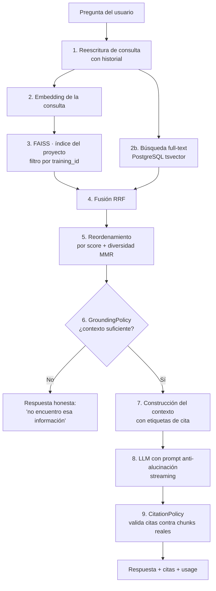

# 11 · Diseño del Sistema RAG con FAISS

## 1. Objetivo

Responder preguntas **exclusivamente** con el contenido de la capacitación, con citas verificables
(video → timestamp, documento → página) y sin alucinar.

## 2. Arquitectura del RAG



## 3. Estrategia de *chunking*

| Parámetro | Valor | Razón |
|-----------|-------|-------|
| Tamaño objetivo | 800 tokens | Equilibrio contexto/precisión para modelos locales de 7–8B |
| Solapamiento | 120 tokens (15 %) | Evita cortar una explicación por la mitad |
| Corte preferente | Fin de oración, luego fin de párrafo | Fragmentos legibles y citables |
| Límite duro | No cruzar frontera de capítulo | Cada chunk pertenece a un único tema |

**Metadatos obligatorios por chunk**

```json
{
  "chunk_id": "uuid", "material_id": "uuid", "training_id": "uuid", "project_id": "uuid",
  "index": 42, "start_time": 872.4, "end_time": 913.8, "page": null,
  "chapter_id": "uuid", "chapter_title": "Inventario cíclico",
  "material_title": "Sesión Inventario", "material_type": "VIDEO", "token_count": 780
}
```

**Video:** los segmentos de Whisper se agrupan hasta llenar el chunk, conservando `start_time` del
primer segmento y `end_time` del último → la cita apunta al minuto exacto.
**Documento:** los bloques se agrupan por página; si un bloque excede el tamaño se parte respetando oraciones.

## 4. Embeddings

Se calculan **en local** con SentenceTransformers, dentro del worker de Celery. No hay
ninguna llamada externa: el texto de la empresa no sale de su infraestructura. Groq no
interviene en esta etapa (su catálogo no expone `/embeddings`).

| `EMBEDDING_MODEL` | Dim. | Cuándo usarlo |
|-------------------|------|---------------|
| **`paraphrase-multilingual-MiniLM-L12-v2`** (por defecto) | 384 | Español + inglés; el más liviano en CPU |
| `paraphrase-multilingual-mpnet-base-v2` | 768 | Mejor calidad multilingüe; ~3× más lento |
| `all-MiniLM-L6-v2` | 384 | Solo inglés; el más rápido |

- Vectores **normalizados L2** → el producto interno de FAISS equivale a similitud coseno.
- Procesamiento por lotes (`EMBEDDING_BATCH_SIZE`, 32 por defecto).
- El modelo y la dimensión quedan registrados en `vector_collections` y en el `meta.json` del
  índice; cambiar de modelo obliga a reconstrucción completa. La incompatibilidad se detecta por
  diferencia de dimensión y **nunca se mezclan vectores de dimensiones distintas**: el índice
  viejo se descarta en memoria y el chat responde "sin contexto" hasta reconstruir con
  `python manage.py rebuild_indices`.

## 5. Índice FAISS

```
/app/indices/
└── {company_slug}/
    └── {project_id}/
        ├── index.faiss        # IndexIDMap2(IndexFlatIP) o IVF/HNSW según tamaño
        ├── mapping.json       # faiss_id → chunk_id
        └── meta.json          # modelo, dimensión, nº vectores, versión, hash
```

**Selección de tipo de índice por tamaño**

| Nº de vectores | Índice | Motivo |
|----------------|--------|--------|
| < 50 000 | `IndexIDMap2(IndexFlatIP)` | Exacto, sin entrenamiento, latencia irrelevante |
| 50 000 – 1 M | `IndexHNSWFlat(M=32, efSearch=64)` | Alta precisión, sin entrenamiento previo |
| > 1 M | `IndexIVFPQ(nlist=4096, m=64)` | Memoria acotada; requiere entrenamiento |

La clase `FaissVectorStore` decide automáticamente y migra el índice al cruzar un umbral durante una
reconstrucción.

**Concurrencia y persistencia**
- Escrituras serializadas con bloqueo por proyecto (Redis lock) — solo los workers escriben.
- Los lectores (backend) mantienen el índice en memoria con recarga si cambia el `version` de `meta.json`.
- Persistencia inmediata tras cada lote (`faiss.write_index`) y escritura atómica (tmp + `os.replace`).
- **Fuente de verdad: PostgreSQL.** El índice siempre es reconstruible desde `chunks`.

## 6. Recuperación híbrida

```python
dense  = faiss.search(query_vec, k=20, filter={"training_id": tid})
sparse = Chunk.objects.filter(training_id=tid).extra(...)  # ts_rank sobre search_vector, k=20
fused  = reciprocal_rank_fusion(dense, sparse, k_const=60)
final  = mmr(fused, lambda_=0.7, top_k=8)   # diversidad: evita 8 chunks del mismo minuto
```

**Filtrado por alcance**
- Por defecto el alcance es la **capacitación** (`training_id`).
- Si `training.cross_material_search = true`, se amplía a todo el **proyecto**.
- Nunca cruza proyectos ni empresas (índice físicamente separado por proyecto).

**Umbral (RN-04):** se descartan chunks con score < `RETRIEVER_MIN_SCORE` (0.35). Si quedan menos de 2
chunks o el mejor score < 0.45, se activa la respuesta honesta sin llamar al LLM.

## 7. Prompt (anti-alucinación)

```
SISTEMA
Eres el tutor virtual de la capacitación "{training_title}" del proyecto "{project_name}".
Respondes SIEMPRE en español, de forma clara y didáctica.

REGLAS ABSOLUTAS
1. Responde ÚNICAMENTE con la información del CONTEXTO. No uses conocimiento externo.
2. Si el CONTEXTO no contiene la respuesta, di exactamente:
   "No encuentro esa información en el material de esta capacitación."
   No inventes, no supongas, no completes con conocimiento general.
3. Cita las fuentes usando los identificadores [1], [2]... tal como aparecen en el CONTEXTO.
   Nunca cites un identificador que no esté en el CONTEXTO.
4. Si el usuario pide un nivel de explicación (principiante, con ejemplo, paso a paso), adáptalo
   sin salirte del CONTEXTO.
5. Cuando la fuente sea un video, menciona el minuto. Cuando sea un documento, menciona la página.

CONTEXTO
[1] (Sesión Inventario · video · 14:32–15:14 · capítulo "Inventario cíclico")
{contenido del chunk}

[2] (Manual WMS · documento · página 23)
{contenido del chunk}

HISTORIAL RECIENTE
{últimos N turnos resumidos}

PREGUNTA
{pregunta reescrita}
```

Parámetros de generación: `temperature=0.1`, `top_p=0.9`, `num_ctx=8192`, `repeat_penalty=1.05`.

## 8. Validación de citas

`CitationPolicy` (dominio, lógica pura):
1. Extrae los `[n]` de la respuesta.
2. Descarta los que no correspondan a un chunk entregado en el contexto.
3. Convierte los válidos en objetos `Citation` con `material_id`, `start_time` o `page` y `label` legible.
4. Si la respuesta afirma contenido pero no cita nada y `grounded` era verdadero, marca
   `needs_review = true` para analítica de calidad.

## 9. Caché

| Nivel | Clave | TTL |
|-------|-------|-----|
| Embedding de consulta | `emb:{sha1(query)}:{model}` | 24 h |
| Resultado de recuperación | `ret:{training_id}:{sha1(query)}:{k}` | 10 min |
| Respuesta completa | `ans:{training_id}:{sha1(query)}:{model}` | 1 h (solo si `grounded`) |

La caché se invalida por `training_id` cuando cambia cualquier material de esa capacitación.

## 10. Evaluación de calidad del RAG

| Métrica | Cómo se mide | Objetivo |
|---------|--------------|----------|
| *Groundedness* | % de respuestas con al menos una cita válida | ≥ 90 % |
| *Answer rate* | % de preguntas respondidas (no "sin información") | ≥ 80 % |
| *Citation precision* | Revisión manual sobre muestra de 50 respuestas | ≥ 95 % |
| Latencia primer token | Medida en el consumer WS | p95 < 2,5 s |
| Falsos "sin información" | Preguntas del *golden set* que sí estaban en el material | ≤ 5 % |

Se mantiene un **golden set** por proyecto (20–50 preguntas con respuesta esperada y fuente) ejecutable
con `python manage.py rag_eval --project <id>`; sirve de test de regresión al cambiar modelo o parámetros.

## 11. Reconstrucción de embeddings (RN-10)

```
rebuild_project_index(project_id)
  1. Lock Redis del proyecto
  2. Leer todos los chunks del proyecto desde PostgreSQL (paginado)
  3. Regenerar embeddings por lotes con el proveedor actual
  4. Construir índice nuevo en indices/{...}/_tmp/
  5. Escritura atómica: os.replace(_tmp, actual) + bump de versión
  6. Actualizar vector_collections (modelo, dimensión, nº vectores, last_rebuilt_at)
  7. Notificar por WebSocket · liberar lock
```
Durante la reconstrucción el índice antiguo sigue sirviendo consultas (sin caída del chat).

## 12. Portabilidad del almacén vectorial

`VectorStorePort` expone `add`, `search`, `delete_by_material`, `rebuild`, `stats`.
Implementaciones: `FaissVectorStore` (por defecto), y adaptadores previstos para `PgVectorStore` y
`QdrantVectorStore`. Cambiar de motor no toca `domain` ni `application`, solo una variable de entorno.
