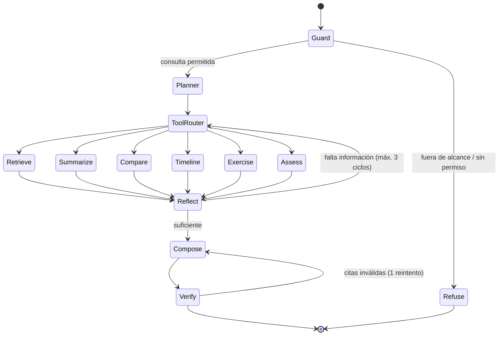

# 12 · Diseño del Agente de IA

## 1. Rol del agente

El **Tutor Virtual** es un agente con herramientas, construido sobre LangGraph, que va más allá del
RAG de una sola pasada: puede planificar, usar varias herramientas, comparar materiales y producir
artefactos (ejercicios, evaluaciones, explicaciones paso a paso).

**Restricción fundacional:** todas sus herramientas leen únicamente del conocimiento del proyecto/
capacitación. El agente **no tiene acceso a Internet** ni a conocimiento externo.

## 2. Proveedor de modelo (gratuito por defecto)

| Uso | Modelo por defecto (Ollama, gratis) | Alternativa de pago |
|-----|-------------------------------------|---------------------|
| Chat / tutor / razonamiento | `qwen2.5:1.5b-instruct` | `gpt-4o-mini` |
| Generación estructurada (exámenes) | `qwen2.5:1.5b-instruct` (modo JSON) | `gpt-4o-mini` |
| Embeddings | `nomic-embed-text` (768 dim) | `text-embedding-3-small` |
| Transcripción | `faster-whisper small` (local) | API de Whisper |

**Por qué un modelo de 1.5B por defecto:** el objetivo es que la plataforma funcione en el
equipo de cualquier desarrollador, sin GPU. Un modelo de 7B en CPU tarda decenas de minutos
por cadena de análisis y satura la máquina. Con `AI_ANALYSIS_MAX_CHARS` acotado, un 1.5B
produce JSON válido y respuestas de RAG correctas, porque el trabajo pesado (encontrar el
fragmento correcto) lo hace el recuperador, no el modelo.

Escalar es cambiar una variable:

| Hardware | `OLLAMA_LLM_MODEL` |
|----------|--------------------|
| CPU 4 núcleos | `qwen2.5:1.5b-instruct` |
| CPU 8+ núcleos | `llama3.2:3b-instruct` |
| GPU | `qwen2.5:7b-instruct` |

Todo se resuelve mediante `AIProviderFactory` según `AI_PROVIDER`; el dominio nunca conoce el proveedor.

## 3. Grafo del agente (LangGraph)



### Nodos

| Nodo | Responsabilidad |
|------|-----------------|
| **Guard** | Valida permisos (inscripción, tenant) y que la petición sea sobre la capacitación. Bloquea *prompt injection* del contenido recuperado. |
| **Planner** | Descompone la instrucción en pasos y elige herramientas. Con modelos pequeños usa un plan de plantilla por intención detectada. |
| **ToolRouter** | Ejecuta la herramienta elegida con argumentos validados por esquema. |
| **Reflect** | Evalúa si lo recuperado responde la pregunta; decide iterar o componer. Máximo 3 ciclos (evita bucles y costo). |
| **Compose** | Redacta la respuesta final adaptada al nivel solicitado, con citas. |
| **Verify** | Aplica `CitationPolicy` y `GroundingPolicy`. Si detecta afirmaciones sin respaldo, obliga a recomponer o degrada a respuesta honesta. |
| **Refuse** | Devuelve una negativa clara y útil (sugerir al instructor, indicar qué material sí existe). |

### Estado del grafo

```python
class AgentState(TypedDict):
    training_id: UUID
    user_id: UUID
    level: Literal["beginner", "intermediate", "advanced"]
    question: str
    rewritten_question: str
    history: list[Message]
    plan: list[str]
    retrieved: list[RetrievedChunk]
    tool_calls: list[ToolCall]
    iterations: int
    draft: str
    citations: list[Citation]
    grounded: bool
    usage: TokenUsage
```

## 4. Herramientas

| Herramienta | Firma | Descripción |
|-------------|-------|-------------|
| `search_knowledge` | `(query: str, top_k: int = 8, material_id: UUID \| None)` | Recuperación híbrida sobre la capacitación. Devuelve chunks con cita. |
| `get_material_summary` | `(material_id: UUID)` | Resumen ejecutivo y capítulos ya generados en la ingesta. |
| `get_transcript_range` | `(material_id: UUID, start: float, end: float)` | Transcripción literal de un tramo → responde "el procedimiento del minuto 14". |
| `get_document_page` | `(material_id: UUID, page: int)` | Texto de una página concreta. |
| `list_materials` | `()` | Materiales disponibles de la capacitación con tipo y duración. |
| `compare_materials` | `(material_ids: list[UUID], aspect: str)` | Recupera en paralelo por material y produce una comparación estructurada. |
| `get_concepts` | `(material_id: UUID \| None)` | Conceptos clave con definición y ubicación. |
| `create_exercise` | `(topic: str, difficulty: str, count: int)` | Ejercicios prácticos basados en el contenido, con solución. |
| `generate_assessment` | `(num_questions: int, distribution: dict, level: str)` | Crea un examen en `DRAFT` (misma cadena que CU-13). |
| `explain_step_by_step` | `(topic: str, level: str)` | Descompone un procedimiento en pasos numerados citando el material. |
| `find_timestamp` | `(topic: str)` | Devuelve los momentos del video donde se trata un tema. |

Cada herramienta:
- Recibe implícitamente `training_id` y `user_id` desde el estado (**nunca** desde el LLM) → imposible
  escapar del alcance mediante *prompt injection*.
- Valida argumentos con Pydantic.
- Devuelve `(payload, citations)`; las citas se acumulan en el estado.

## 5. Detección de intención (barata, sin LLM cuando se puede)

| Patrón del usuario | Intención | Ruta |
|--------------------|-----------|------|
| "¿qué explicó… sobre X?" | pregunta factual | `search_knowledge` → Compose |
| "muéstrame lo del minuto N" | ubicación temporal | `get_transcript_range` |
| "resume el capítulo N" | resumen | `get_material_summary` |
| "explícamelo como principiante" | adaptación de nivel | reusar contexto anterior + Compose(level) |
| "dame un ejemplo" | ejemplificación | `search_knowledge` + Compose(ejemplo) |
| "compara el video A con el manual B" | comparación | `compare_materials` |
| "hazme ejercicios de X" | práctica | `create_exercise` |
| "prepárame un examen" | evaluación | `generate_assessment` |
| "explícame paso a paso" | procedimiento | `explain_step_by_step` |

Esto reduce latencia y costo: la mayoría de las consultas resuelve en una sola pasada RAG y solo las
complejas activan el ciclo completo del grafo.

## 6. Adaptación al nivel del usuario

El nivel se determina por: preferencia explícita del mensaje > perfil del usuario > desempeño en
exámenes previos (< 50 % → principiante; > 85 % → avanzado).

| Nivel | Estilo de composición |
|-------|-----------------------|
| Principiante | Sin jerga; cada término técnico se define; analogías cotidianas; pasos muy explícitos |
| Intermedio | Vocabulario del dominio con recordatorios breves; foco en el "cómo" |
| Avanzado | Directo, denso, con casos borde, excepciones y referencias cruzadas |

## 7. Seguridad del agente

| Riesgo | Mitigación |
|--------|-----------|
| *Prompt injection* desde el material transcrito | El contexto se inserta delimitado y etiquetado como datos no confiables; instrucción explícita de ignorar órdenes dentro del contexto |
| Fuga entre capacitaciones/empresas | `training_id` y `company_id` provienen del token, nunca del LLM; el índice está separado por proyecto |
| Bucle infinito de herramientas | Máx. 3 iteraciones y 8 llamadas a herramientas por ejecución |
| Costo/latencia descontrolada | Presupuesto de tokens por ejecución; timeout de 60 s; rate limit por usuario |
| Alucinación | `GroundingPolicy` + `CitationPolicy` + `Verify`; degradación a respuesta honesta |
| Extracción de la clave de exámenes vía chat | Los chunks de preguntas/respuestas de examen se excluyen del índice consultable por estudiantes |

## 8. Observabilidad

Cada ejecución registra: intención detectada, plan, herramientas usadas con argumentos y latencia,
nº de chunks recuperados y scores, `grounded`, tokens in/out, modelo, latencia total y feedback del
usuario (👍/👎). Todo alimenta `ai_usage_logs` y el panel "Utilización de IA".

## 9. Degradación elegante

| Falla | Comportamiento |
|-------|----------------|
| Ollama no responde | 503 `AI_PROVIDER_UNAVAILABLE`; el mensaje del usuario se conserva y se ofrece reintento |
| Índice del proyecto no cargado | Se reconstruye en caliente desde PostgreSQL; mientras tanto, búsqueda full-text |
| Modelo devuelve JSON inválido | *Output parser* correctivo (1 reintento) → si falla, resultado parcial marcado |
| Timeout de herramienta | Se compone con lo disponible e informa qué no se pudo consultar |
