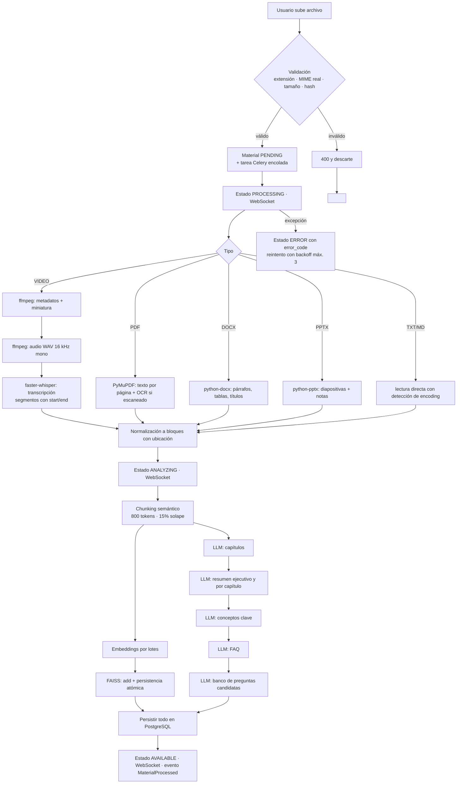
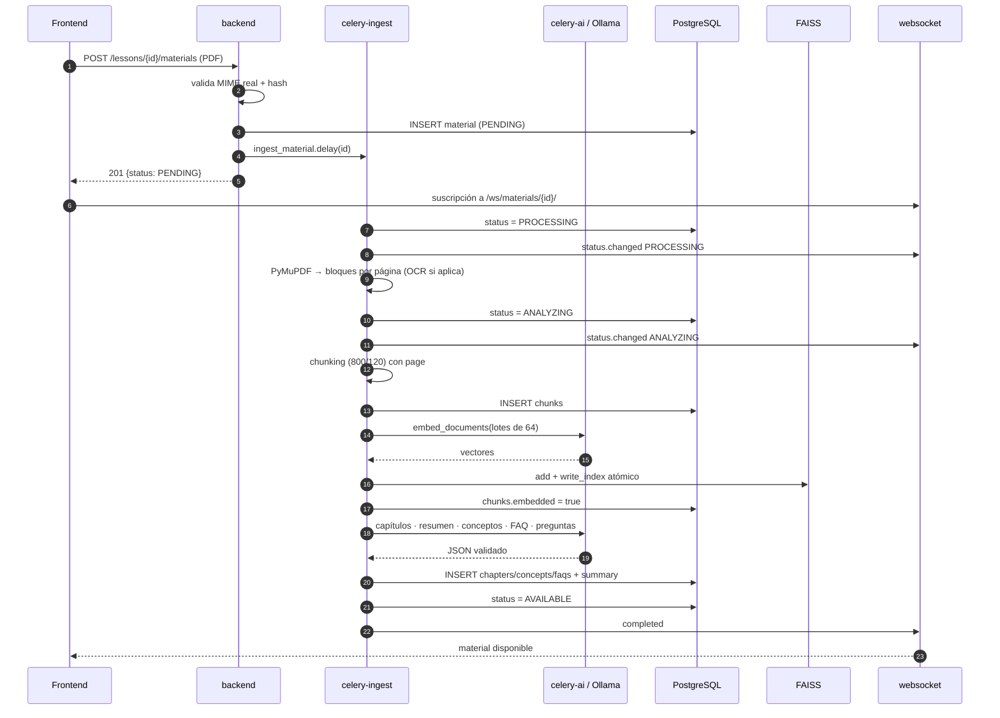

# 13 · Flujo de Procesamiento de Videos y Documentos

## 1. Vista general



## 2. Etapas detalladas

### Etapa 0 · Carga

- Carga por trozos de 5 MB con reanudación; los trozos viven 24 h.
- Al completar: ensamblado, SHA-256, validación de MIME real con `python-magic`, verificación de duplicado
  por `(project_id, sha256)`.
- Límites: video 4 GB, documento 100 MB.
- El archivo se guarda en `media/{company}/{project}/{material_id}/original.{ext}` con permisos restringidos.

### Etapa 1 · Extracción (cola `ingest`)

**Video**
```bash
ffprobe -v error -show_format -show_streams          # duración, códecs, resolución
ffmpeg -i input.mp4 -ss 00:00:03 -vframes 1 thumb.jpg
ffmpeg -i input.mp4 -vn -ac 1 -ar 16000 -c:a pcm_s16le audio.wav
```

**Transcripción (`faster-whisper`, gratuito y local)**
```python
model = WhisperModel(WHISPER_MODEL, device=WHISPER_DEVICE, compute_type=WHISPER_COMPUTE_TYPE)
segments, info = model.transcribe(
    "audio.wav", language=None, vad_filter=True,
    vad_parameters={"min_silence_duration_ms": 500}, beam_size=5, word_timestamps=False,
)
```
Salida: `[{index, start, end, text}]` + `language` + `confidence`.
El filtro VAD elimina silencios → menos tiempo de cómputo y menos alucinación de Whisper.

Para audios largos, la transcripción se reporta por progreso (`processing_jobs.progress`) cada N segmentos.

**Documentos**

| Formato | Librería | Se preserva |
|---------|----------|-------------|
| PDF | PyMuPDF (`fitz`) | Página, orden de bloques, títulos por tamaño de fuente. Si la página no tiene texto → OCR (`pytesseract`) |
| DOCX | `python-docx` | Jerarquía de encabezados, párrafos, tablas → Markdown |
| PPTX | `python-pptx` | Nº de diapositiva, título, cuerpo y **notas del presentador** |
| TXT/MD | Lectura directa | Encoding detectado con `charset-normalizer` |

Alternativa unificada disponible: `unstructured` para formatos complejos u OCR avanzado.

### Etapa 2 · Normalización

Todo extractor devuelve la misma estructura, de modo que las etapas siguientes son idénticas para
video y documento:

```python
@dataclass
class ContentBlock:
    text: str
    start_time: float | None    # video
    end_time: float | None      # video
    page: int | None            # documento
    heading: str | None
    order: int
```

### Etapa 3 · Chunking

Ver `11-diseno-rag.md` §3. Reglas: 800 tokens, 15 % de solape, corte en fin de oración,
no cruzar frontera de capítulo, metadatos de ubicación siempre presentes.

### Etapa 4 · Embeddings e indexación

```
lotes de 64 → EmbeddingsPort.embed_documents() → normalización L2
            → FaissVectorStore.add(vectors, ids) → write_index atómico
            → Chunk.embedded = True (transacción por lote)
```
Si el proceso se interrumpe, al reintentar solo se procesan los chunks con `embedded = false`.

### Etapa 5 · Análisis con LLM

El costo de esta etapa es **casi proporcional a los tokens que el modelo genera**.
Medido en CPU con `qwen2.5:1.5b-instruct`: ~2 tokens/s, es decir 250–570 s por
cadena. Por eso el análisis es adaptativo:

| Tamaño del contenido | Estrategia | Llamadas al LLM |
|----------------------|-----------|-----------------|
| ≤ `AI_COMPACT_ANALYSIS_CHARS` (5.000 por defecto) | **Análisis compacto**: una sola llamada devuelve resumen, conceptos y FAQ; el material se registra como un único capítulo | **1** |
| Mayor | Cadenas independientes: capítulos, resumen, conceptos y FAQ | 4 |

Un documento de una página no tiene capítulos que detectar, así que ejecutar
cuatro cadenas sobre él cuadruplica el tiempo sin aportar nada. Además cada
cadena declara su propio `max_tokens` (400–700) para que una respuesta
innecesariamente extensa no dispare el tiempo de proceso.

Cadenas del análisis completo, cada una con salida validada por Pydantic y
reintento correctivo:

| Cadena | Entrada | Salida |
|--------|---------|--------|
| Capítulos | Transcripción/documento comprimido con marcas de tiempo o página | `[{title, start, end, summary}]` |
| Resumen ejecutivo | Resúmenes por capítulo (map-reduce) | Texto de 150–300 palabras |
| Conceptos | Capítulos + chunks representativos | `[{name, definition, relevance, first_mention_time/page}]` |
| FAQ | Contenido completo comprimido | `[{question, answer}]` (6–12) |
| Preguntas candidatas | Chunks con cobertura por capítulo | Banco reutilizable en CU-13 |

Para materiales largos se usa **map-reduce**: resumen por capítulo → resumen de resúmenes. Así el
pipeline funciona incluso con modelos locales de ventana modesta (8k tokens).

### Etapa 6 · Cierre

- `Material.status = AVAILABLE` (o `partial_analysis = true` si alguna cadena LLM falló pero los
  embeddings sí se generaron: el chat ya es funcional).
- Se emite `MaterialProcessed`; el instructor recibe notificación y sugerencia de generar examen.
- Se registra el consumo total de IA del material.

## 3. Idempotencia y reintentos

| Aspecto | Implementación |
|---------|----------------|
| Idempotencia | Cada etapa comprueba si su salida ya existe (transcripción, chunks, embeddings) y la omite |
| Reintentos | `autoretry_for=(TransientError,)`, `retry_backoff=True`, `max_retries=3` |
| Reproceso | `POST /materials/{id}/reprocess` borra las salidas derivadas y reencola desde cero |
| Limpieza | Los temporales (`audio.wav`, trozos) se eliminan en `finally` |
| Trazabilidad | `processing_jobs` guarda paso, progreso, tiempos y error de cada ejecución |

## 4. Códigos de error del pipeline

| `error_code` | Causa | Acción sugerida |
|--------------|-------|-----------------|
| `INVALID_FILE_TYPE` | MIME real ≠ extensión | Volver a subir el archivo correcto |
| `FILE_TOO_LARGE` | Excede el límite | Comprimir o dividir |
| `AUDIO_EXTRACTION_FAILED` | Video corrupto o sin pista de audio | Verificar el archivo |
| `NO_SPEECH_DETECTED` | Audio sin voz | Revisar la grabación |
| `TRANSCRIPTION_FAILED` | Fallo de Whisper | Reintentar o usar un modelo menor |
| `EXTRACTION_FAILED` | Documento corrupto o protegido | Quitar la protección |
| `EMPTY_CONTENT` | No se obtuvo texto (PDF escaneado sin OCR) | Habilitar OCR |
| `EMBEDDING_PROVIDER_UNAVAILABLE` | Ollama/OpenAI caído | Reintentar; el material queda reprocesable |
| `LLM_ANALYSIS_FAILED` | Fallo en las cadenas de análisis | El material queda `AVAILABLE` con `partial_analysis` |
| `INDEX_WRITE_FAILED` | Error de IO en el volumen de índices | Revisar disco/permisos |

## 5. Rendimiento estimado

| Escenario | Hardware | Tiempo aprox. |
|-----------|----------|---------------|
| Video 60 min, Whisper `small`, CPU 8 núcleos | Sin GPU | 20–35 min |
| Video 60 min, Whisper `small`, GPU | RTX 3060 | 3–6 min |
| Embeddings de 400 chunks con `nomic-embed-text` en CPU | — | 1–3 min |
| Análisis LLM (4 cadenas) con `qwen2.5:1.5b` en CPU | 4 núcleos | 2–6 min |
| Análisis LLM (4 cadenas) con `qwen2.5:7b` | GPU | < 1 min |
| Análisis LLM (4 cadenas) con `qwen2.5:7b` en CPU | 4 núcleos | **inviable** (supera `OLLAMA_TIMEOUT`) |
| PDF de 200 páginas | CPU | 1–2 min + embeddings |

> **Elección del modelo.** La etapa de análisis es la única que exige un LLM potente. Si el
> modelo no alcanza a responder dentro de `OLLAMA_TIMEOUT`, el material igual queda
> `AVAILABLE` con `partial_analysis = true`: el chat RAG funciona porque los embeddings ya
> están. Es una degradación deliberada, no un fallo silencioso — el log indica exactamente
> qué bajar (`OLLAMA_LLM_MODEL` o `AI_ANALYSIS_MAX_CHARS`).

**Optimizaciones aplicadas:** VAD antes de transcribir, lotes de embeddings, cadenas LLM en paralelo
donde no hay dependencia, cola `ingest` separada con concurrencia baja (`--concurrency=2`) para no
saturar CPU, y reutilización del modelo Whisper cargado en memoria del worker.

## 6. Diagrama de secuencia completo (documento PDF)


