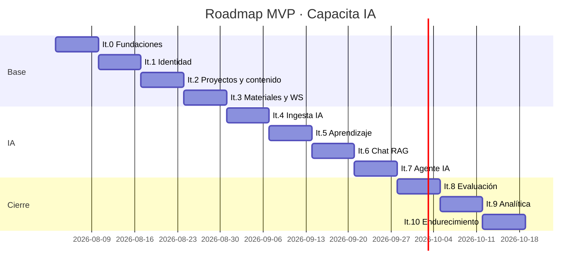

# 14 · Plan de Desarrollo por Iteraciones (MVP)

Iteraciones de 1 semana. Cada una termina con software ejecutable con `docker compose up`.

---

## Iteración 0 · Fundaciones
**Objetivo:** el stack completo arranca y se comunica.

- Estructura del repositorio y documentación (este directorio).
- `docker-compose.yml` (dev) y `docker-compose.prod.yml` con los 13 servicios.
- Dockerfiles multi-stage: backend, websocket, celery-ingest (con ffmpeg), frontend, nginx.
- Django 5 con settings por entorno, `shared/` (Clean Architecture base), health checks.
- Frontend Vite + TS + MUI con tema y layout base.
- Celery + Redis operativos; contenedor `websocket` con Daphne respondiendo un ping.
- Ollama con modelos descargados.

**Criterio de aceptación:** `docker compose up` levanta todo sano; `/health/ready` responde 200;
`/api/docs/` muestra Swagger; el frontend carga y `wss://…/ws/ping/` responde.

---

## Iteración 1 · Identidad y acceso (M1)
- Modelos `Company` y `User` (usuario personalizado con email como identificador).
- JWT: login, refresh con rotación, logout con blacklist, `/auth/me`.
- Roles y permisos DRF; middleware de tenant con `ContextVar`; `TenantManager`.
- Recuperación de contraseña por email (MailHog en dev).
- CRUD de usuarios y grupos.
- Frontend: login, recuperación, `AuthContext`, rutas protegidas por rol, layout admin/usuario.
- Auditoría de accesos.

**Aceptación:** HU-001 a HU-004 verdes; un usuario de la empresa A recibe 404 al pedir datos de la B.

---

## Iteración 2 · Proyectos y estructura de contenido (M2 + M3 parcial)
- CRUD de proyectos con aprovisionamiento de `VectorCollection`.
- CRUD de capacitaciones, módulos y lecciones con reordenamiento.
- Publicar/despublicar con validación de reglas.
- Frontend: listado y detalle de proyectos, constructor de capacitación con drag & drop.

**Aceptación:** HU-010, HU-011, HU-020.

---

## Iteración 3 · Materiales y tiempo real (M3 + M8)
- Carga por trozos con validación de MIME real, hash y cuota.
- Modelo `Material` con máquina de estados y `ProcessingJob`.
- Contenedor WebSocket: consumer de estado de material autenticado por JWT.
- Publicación de eventos desde Celery al *channel layer*.
- Servido protegido de video (URL firmada / `X-Accel-Redirect`).
- Frontend: zona de carga con progreso y estado en vivo.

**Aceptación:** HU-021, HU-022. Subir un video de 1 GB y ver el cambio de estado sin recargar.

---

## Iteración 4 · Pipeline de ingesta con IA (M5 · parte 1)
- Puertos `TranscriberPort`, `DocumentExtractorPort`, `EmbeddingsPort`, `LLMPort`, `VectorStorePort`.
- Adaptadores: ffmpeg, `faster-whisper`, PyMuPDF/docx/pptx/txt, Ollama (LLM y embeddings), FAISS.
- `AIProviderFactory` conmutable Ollama ↔ OpenAI por variable de entorno.
- Tarea `ingest_material` completa: transcripción → normalización → chunking → embeddings → índice.
- Cadenas LLM: capítulos, resumen, conceptos, FAQ, preguntas candidatas.
- Frontend: vista de análisis del material (transcripción, capítulos, resumen, conceptos).

**Aceptación:** HU-023, HU-024. Un video sube y queda `AVAILABLE` con todos sus artefactos.

---

## Iteración 5 · Aprendizaje (M4)
- Inscripciones individuales y por grupo; `LessonProgress`; cálculo de avance.
- Reproductor con capítulos, transcripción sincronizada, guardado de posición y autocompletado al 90 %.
- Búsqueda dentro del curso (full-text sobre chunks).
- Dashboard del usuario con cursos y avance.

**Aceptación:** HU-030 a HU-033, HU-061.

---

## Iteración 6 · Chat RAG (M5 · parte 2)
- Recuperación híbrida (FAISS + full-text con RRF + MMR).
- `GroundingPolicy` y `CitationPolicy`.
- Caso de uso `answer_question` con prompt anti-alucinación.
- Streaming por WebSocket token a token.
- Persistencia de sesiones, mensajes, citas y `ai_usage_logs`.
- Frontend: panel de chat con citas clickeables que saltan al minuto del video.

**Aceptación:** HU-040, HU-041, HU-044. Una pregunta fuera del material devuelve la respuesta honesta.

---

## Iteración 7 · Agente IA (M5 · parte 3)
- Grafo LangGraph con nodos Guard/Planner/ToolRouter/Reflect/Compose/Verify.
- Herramientas: `search_knowledge`, `get_transcript_range`, `compare_materials`, `create_exercise`,
  `explain_step_by_step`, `find_timestamp`, `get_concepts`, `list_materials`.
- Adaptación al nivel del usuario.
- Endpoint `/trainings/{id}/agent/run` y UI de acciones rápidas en el chat.

**Aceptación:** HU-042, HU-043.

---

## Iteración 8 · Evaluación (M6)
- Modelos `Exam`, `Question`, `QuestionOption`, `Attempt`, `Answer`.
- Generación de exámenes con IA con salida estructurada validada y cobertura por capítulo.
- Editor de exámenes para el instructor; publicación.
- Rendición con temporizador, guardado parcial y control de intentos.
- Corrección: determinística para cerradas, LLM con rúbrica para abiertas.
- Retroalimentación con enlace a la sección a repasar.

**Aceptación:** HU-050 a HU-052.

---

## Iteración 9 · Analítica y administración (M7)
- Dashboard admin con KPIs, progreso, resultados y preguntas más falladas.
- Panel de utilización de IA (tokens, costo, tasa de "sin contexto").
- Exportación CSV/XLSX.
- Reconstrucción de índice desde la UI.

**Aceptación:** HU-053, HU-060, HU-062.

---

## Iteración 10 · Endurecimiento y producción
- Rate limiting, cabeceras de seguridad, CSP, validación exhaustiva de archivos.
- `docker-compose.prod.yml` con Gunicorn, réplicas, límites de recursos y TLS.
- Tests: unitarios de dominio y aplicación (≥ 70 %), integración de repositorios y adaptadores, e2e de API.
- `golden set` de evaluación del RAG y comando `rag_eval`.
- Logs JSON, métricas Prometheus, Sentry opcional.
- Guía de despliegue, backup y restauración.

**Aceptación:** todos los RNF verificados; despliegue en un entorno limpio siguiendo solo el README.

---

## Cronograma

## Riesgos

| Riesgo | Prob. | Impacto | Mitigación |
|--------|-------|---------|------------|
| Whisper demasiado lento en CPU | Alta | Alto | Modelo `small` + VAD; documentar perfil GPU; cola `ingest` dedicada |
| Calidad insuficiente de modelos locales para JSON estructurado | Media | Alto | Salidas Pydantic con reintento correctivo; opción de conmutar a OpenAI con una variable |
| FAISS en volumen compartido con múltiples nodos | Media | Medio | Escrituras solo desde workers con lock; `VectorStorePort` permite migrar a Qdrant |
| Cargas de 4 GB inestables | Media | Medio | Carga por trozos reanudable + `proxy_request_buffering off` |
| Alucinación en respuestas | Media | Alto | Umbral de recuperación, validación de citas, golden set de regresión |
| Costos de IA si se activa OpenAI | Baja | Medio | Ollama por defecto (gratis); presupuesto y panel de consumo |

## Post-MVP

Certificados PDF, gamificación, rutas de aprendizaje, SCORM/xAPI, SSO SAML/OIDC, app móvil,
subtítulos multi-idioma, detección de diapositivas por visión, recomendación de contenido.
